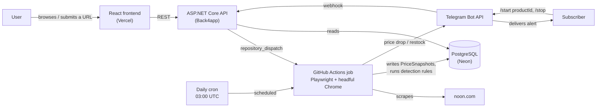
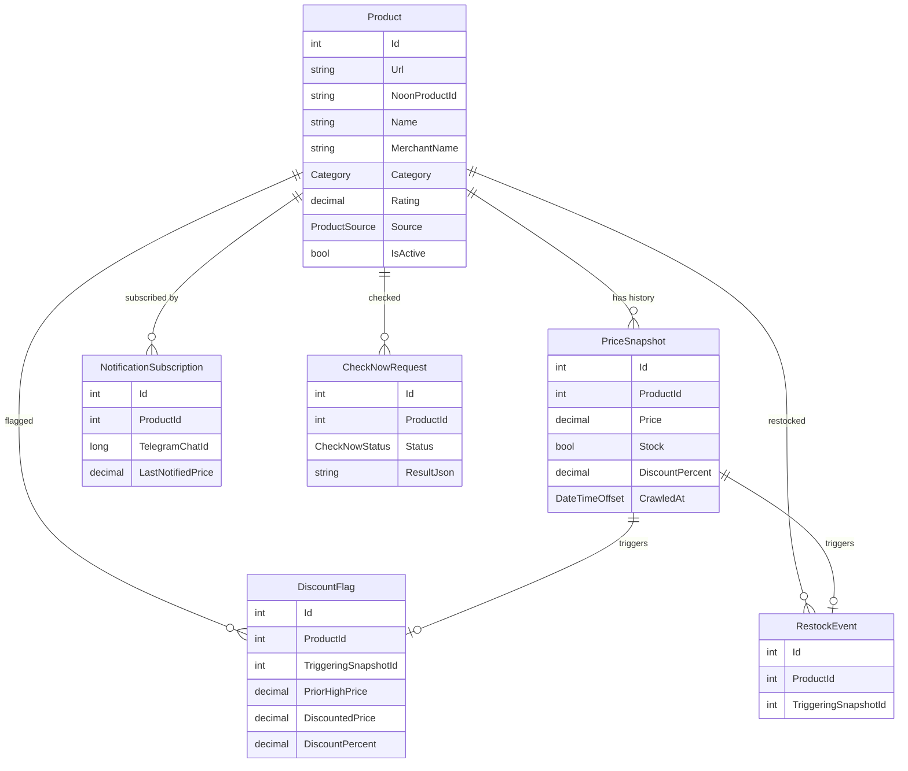

# Noon Scraper

A full-stack data platform that scrapes live product listings from [noon.com](https://www.noon.com) — the largest e-commerce platform in the MENA region — normalizes and persists them, then runs rule-based analysis over the resulting price history to surface restocks and discounts that don't hold up against a product's own past prices. An ASP.NET Core API exposes that data to a React frontend, a Telegram bot pushes alerts when something changes, and a GitHub Actions pipeline handles every part of the pipeline that needs a real, stealth-configured browser — because the API's own hosting has no browser available to it at all.

This is not a script that dumps scraped rows into a table. It's a system with a normalized relational schema, a rule engine over time-series price data, an on-demand cross-merchant comparison feature that scrapes live rather than reading a cache, and a deliberate infrastructure split (API vs. browser-capable background jobs) driven by a real hosting constraint. Details below are verified against the actual code, not aspirational.

**Live demo:** [noon-scraper-phi.vercel.app](https://noon-scraper-phi.vercel.app) · **API:** the current URL is tracked in [`Backend/README.md`](Backend/README.md) (it changes — see [`Backend/docs/hosting.md`](Backend/docs/hosting.md) for why, and don't be surprised if it's stale)

[](https://github.com/alieldeenahmed/Noon-Scraper/actions/workflows/ci.yml)      

## Screenshots

**Product list** — server-side search, category filter, sortable columns, and pagination over the tracked set:


**Product detail** — every crawl kept as a price-history log, with the fake-discount flag surfaced next to the product's own history (this product swung from EGP 624 to 702 and back, with 5 flagged discounts):


**Mobile** — the same list on a phone-width viewport:


Captured from a local run against the real database; the data is real scraped noon.com data.

## Overview

The system tracks two kinds of products: five seeded category pages (Mobiles, Laptops, Skin Care, Hair Care, Personal Care) crawled on a daily schedule, and any product a user submits by URL, crawled immediately on submit and then kept up to date by the same daily job. Every crawl writes a new `PriceSnapshot` rather than overwriting the last one, so each product accumulates real history — that history is what the restock and fake-discount rules run against, and what the frontend renders as a price log.

Two things make this more than "scrape a page, show the data": the analysis is genuinely rule-based over stored history (not a snapshot-in-isolation heuristic), and the API itself never touches a browser — every scrape, scheduled or on-demand, is delegated to a GitHub Actions job, because the free hosting tier the API runs on has no headful-Chrome capability. That split is the main architectural decision in this codebase, and it shows up in almost every backend design choice below.

## Key Features

**Data Collection**
- Scheduled daily crawl of five product categories, plus a re-crawl of every user-submitted product on the same schedule
- Immediate, on-demand crawl the moment a user submits a new product URL, instead of waiting for the next scheduled pass
- Stealth-configured, real (headful) Chromium via Playwright — the target site hard-blocks headless Chrome at the network layer, documented in the engineering log
- Product identity normalized against Noon's per-session tracking query strings, so the same product isn't recorded as a new row every crawl

**Price Intelligence**
- Fake-discount detection: flags a claimed discount when the "before" price was itself an inflated recent spike over the product's historical low, rather than trusting the advertised percentage
- Restock detection: recorded the moment a tracked product's most recent snapshot flips from out-of-stock to in-stock
- Both are plain threshold checks against stored `PriceSnapshot` history — no ML, and every decision is traceable to the specific snapshot that triggered it

**Cross-Merchant Comparison**
- On-demand "check now" scrape that finds every seller currently offering a tracked product and returns them sorted by price
- Runs as a real live scrape (not a cached read) via the same GitHub Actions pipeline as the daily crawl, polled to completion by the client

**Notifications**
- Telegram bot subscription via a deep link (`/start <productId>`), so Telegram — not a form — supplies the chat ID
- Alerts sent on a genuine price drop or restock, with a baseline price captured at subscribe time so the first crawl after subscribing can't misfire
- `/stop` unsubscribes a chat from every product at once

**Backend**
- Three-project solution separating shared data access, the API, and the Playwright-driving crawler, so the API has zero browser dependency
- A `ProductUpserter` shared by the daily crawl, the on-demand crawl, and user-added re-crawls, so restock/discount/notification logic lives in exactly one place
- Server-side search, sorting, category filtering, and pagination on the product list, plus a stats endpoint for the headline counts
- Rate limiting (built-in ASP.NET Core limiter) with a tighter tier on the endpoints that trigger metered GitHub Actions runs
- 109 automated tests, run in CI on every push and PR — including the Playwright scrapers, run against saved noon.com markup

**Frontend**
- Product list with debounced search, category filters, sortable columns (price, discount, last crawled), and a pager — all driven by the API
- A product page that live-polls and fills in automatically while a freshly-submitted product is still being crawled, with an elapsed-time progress estimate
- Price history rendered as a chronological log, plus a dedicated cross-merchant comparison panel

## Architecture



The boundary that matters here is the one between the API and the crawler. `NoonScraper.Api` has no reference to Playwright at all — it's a plain, Chrome-free ASP.NET Core app, which is what let it deploy to a free hosting tier with no browser support. Every action that needs a real browser (the daily crawl, an on-demand cross-merchant check, an immediate crawl on submit) is instead handed to `NoonScraper.Crawler`, invoked as a GitHub Actions job — triggered either by the daily cron schedule or by a `repository_dispatch` event the API fires via `GitHubDispatchService`. The API writes a placeholder row (a bare product, or a `CheckNowRequest` with `Status = Pending`) and returns immediately; the frontend polls a read endpoint until the GitHub Actions job has written the real result. `Backend/docs/check-now.md` and `crawl-on-submit.md` cover this in more depth, and `engineering-log.md` #11 explains why it wasn't built this way from the start.

## Tech Stack

| Layer | Technology | Purpose |
|---|---|---|
| Backend | ASP.NET Core (.NET 9) | REST API — read endpoints, product submission, webhook receiver |
| Frontend | React 19 + TypeScript + Vite | Single-page UI, two routes (list, detail) |
| Styling | Tailwind CSS v4 | Utility-first styling, no separate PostCSS config |
| Database | PostgreSQL (Neon) | Persists products, price history, subscriptions, flags |
| ORM | EF Core + Npgsql | Schema, migrations, querying |
| Scraping | Playwright (.NET), headful Chromium | Category and product-page scraping, cross-merchant offer scraping |
| Automation | GitHub Actions | Scheduled daily crawl; on-demand crawl and cross-merchant check via `repository_dispatch` |
| Notifications | Telegram Bot API | Webhook-based subscribe/unsubscribe, outbound alerts |
| Rate limiting | ASP.NET Core `RateLimiter` (built in) | Per-IP and combined caps, tighter on GitHub-dispatching endpoints |
| Testing | xUnit · `WebApplicationFactory` · EF Core InMemory · Playwright | Unit tests for the detection rules; API integration tests on the real pipeline; scraper tests in a real browser against saved markup — see [Testing](#testing) |
| CI | GitHub Actions (`ci.yml`) | Backend build + test, frontend lint + build on every push/PR |
| Linting | oxlint | Frontend lint (`npm run lint`) |
| Hosting | Back4app (API, Docker) · Vercel (frontend) | Both free, card-free tiers |

## Backend Architecture

The backend is three .NET projects with one clear separation: **`NoonScraper.Data`** holds the EF Core models, `AppDbContext`, and the two pieces of pure logic that need no browser and no web framework — `PriceHistoryAnalyzer` (restock/fake-discount rules) and `UrlNormalizer`. **`NoonScraper.Api`** is the ASP.NET Core Web API: two controllers (`ProductsController`, `TelegramController`), two thin services (`GitHubDispatchService`, `TelegramService`), and no Playwright reference anywhere in the project. **`NoonScraper.Crawler`** is a console app that references both `NoonScraper.Data` and Playwright, and is invoked three different ways: with no arguments (the daily crawl), `check-now <requestId>`, or `crawl-product <productId>` — all three converge on the shared `ProductUpserter.UpsertAsync`.

Dependency injection is plain ASP.NET Core built-ins (`AddDbContext`, `AddHttpClient<T>`, constructor injection via primary constructors) — no additional DI container. Configuration reads through `IConfiguration` with an explicit fallback pattern repeated across `Program.cs`, `GitHubDispatchService`, and `TelegramService`: try the standard nested key first (`ConnectionStrings:DefaultConnection`, `Telegram:BotToken`), then fall back to a flat environment variable name (`DATABASE`, `TELEGRAM_BOT_TOKEN`), because Back4app's environment-variable UI rejects the double-underscore naming .NET expects for nested keys.

Validation is minimal and targeted rather than a generic framework: `ProductsController.CreateProduct` checks the submitted URL is an absolute link on `noon.com` or a real subdomain of it (so lookalike hosts such as `evilnoon.com` are rejected) and rejects duplicates by normalized URL, returning `400`/`409` accordingly; the list endpoint rejects unknown `sortBy`/`sortDir` values with `400` and clamps `page`/`pageSize` rather than failing; everything else trusts route-bound IDs and returns `404` via an existence check. Error handling follows a "best-effort, don't fail the request" pattern in exactly the places where that's the honest tradeoff: dispatching a GitHub Actions run is wrapped in try/catch and only logs a warning on failure, because the product/request row is already saved either way and a GitHub API hiccup shouldn't turn a successful write into a failed response.

The product list is paged, searched, and sorted in the database (`ProductsController.GetProducts`): each product is projected together with its latest `PriceSnapshot`, filtered and ordered on that projection, and only the requested page is materialized. Products with no value for the sorted field (never crawled, no discount) sort last in either direction rather than wherever Postgres's NULL ordering would put them, and ties break on `Id` so pages never repeat or skip rows.

Rate limiting uses ASP.NET Core's built-in limiter (`Services/RateLimiting.cs`), with three fixed one-minute windows, all configurable under `RateLimiting:*`: every request per client IP (300), the endpoints that dispatch a GitHub Actions run per client IP (5), and those same endpoints across all clients combined (30). The combined cap exists because per-IP limits are only as trustworthy as the client IP, and behind the hosting platform's proxy chain of unknown depth the IP comes from a client-forgeable `X-Forwarded-For` header — the combined bucket protects the metered GitHub Actions quota regardless of what IP a caller claims. Rejections return `429` with `Retry-After`, and the limiter sits after CORS so the browser can still read them.

CORS is environment-aware rather than a single hardcoded origin: in `Development`, any `localhost` origin is trusted regardless of port (Vite's dev server doesn't always land on the same port), while outside `Development` only the deployed Vercel origin is allowed.

## Data & Database Design



`Product.Url` carries a unique index — the enforcement point for the identity problem described in the Scraping Pipeline section below. `PriceSnapshot` is append-only: a crawl never updates a prior snapshot, it inserts a new one, which is what makes historical comparisons (and the price-history log in the UI) possible; it's indexed on `(ProductId, CrawledAt)` for that access pattern. `DiscountFlag` and `RestockEvent` both store a foreign key to the specific `PriceSnapshot` that triggered them, not just a timestamp, so a flag is always traceable back to the exact data that caused it. `NotificationSubscription` has a unique composite index on `(ProductId, TelegramChatId)` to prevent duplicate subscriptions, and every child table cascades on `Product` delete. The schema evolved across three migrations (`InitialCreate`, `AddCheckNowRequest`, `AddRestockEvent`) rather than being designed monolithically upfront.

## Scraping Pipeline

```
noon.com
  ↓  Playwright + headful Chromium, stealth init script
CategoryScraper (listing pages) / ProductPageScraper (detail pages)
  ↓  extraction
CategoryScraper reads data-qa attributes off listing tiles;
ProductPageScraper parses the page's schema.org JSON-LD block instead of the DOM
  ↓  normalization
UrlNormalizer strips tracking query params → stable product identity
  ↓  validation
ProductUpserter checks for an existing Product by normalized URL (upsert, not blind insert)
  ↓  persistence
New PriceSnapshot row + PriceHistoryAnalyzer runs restock/fake-discount checks against prior snapshots
  ↓  API
ASP.NET Core reads the resulting rows
  ↓  frontend
React polls/fetches and renders price history, flags, and restock events
```

Two extraction strategies are used deliberately, not interchangeably: category listing pages expose stable `data-qa` attributes on each product tile, so `CategoryScraper` reads those directly. The product **detail** page has no such attributes for name or rating, and the merchant name only exists in a hydrated DOM behind build-hashed CSS class names that could change on any frontend redeploy — so `ProductPageScraper` instead parses the page's embedded `schema.org` `Product` JSON-LD block, which gives clean name, SKU, price, discount, rating, seller, and real stock-availability data in one structured object. `OfferScraper` (used only for the on-demand cross-merchant check) follows a third pattern: it reads the single default offer straight from that same JSON-LD when a product has one seller, and only interacts with the DOM to expand and read the "other sellers" panel when one exists.

Headless Chrome is not an option here — the target site returns a hard connection-layer failure for headless requests, confirmed and documented in the engineering log, so every environment that runs the crawler (local WSL2, GitHub Actions) launches a real, visible Chromium instance under a virtual display (`xvfb-run` in CI) rather than true headless mode. A stealth init script (in `StealthBrowser`) overrides `navigator.webdriver`, fakes a `window.chrome.runtime` object, and populates `navigator.plugins`/`languages` to avoid the cheapest static automation fingerprints — this is explicitly documented as defeating static detection, not behavioral analysis.

Failure handling is per-item, not per-run: `CategoryScraper` failures for one category are caught and logged, and the loop continues to the next category rather than aborting the whole crawl; a user-added product that fails to scrape is skipped for that pass rather than corrupting the run. The on-demand `crawl-product` and `check-now` CLI modes each wrap their single scrape in a try/catch that records `Failed`/an error message rather than leaving the request row stuck in `Pending` forever.

## API

No authentication or authorization exists anywhere in this API — every endpoint is open, protected only by the rate limits described above. Routes are grouped by feature below rather than listed exhaustively; see `Backend/README.md` for the full reference table.

**Products**
- `GET /api/products` — one page of tracked products, each with its latest price/stock/discount already joined in. Query parameters: `category`, `search` (case-insensitive substring of the name, or the URL for products not yet crawled), `sortBy` (`crawled` \| `price` \| `discount`, default `crawled`), `sortDir` (`asc` \| `desc`, default `desc`), `page` (default 1), `pageSize` (default 25, max 100). Returns `{ items, total, page, pageSize, totalPages }`.
- `GET /api/products/stats` — `{ total, inStock, onDiscount }` for the headline counts, optionally scoped with `?category=`
- `GET /api/products/{id}` — full detail for one product, including the same latest-snapshot fields
- `POST /api/products` — submit a `{ "url": "..." }` to track; validates it's a `noon.com` link, normalizes it, rejects duplicates with `409`, inserts a bare record, and best-effort dispatches an immediate crawl. Rate-limited (dispatch tier).
- `GET /api/products/{id}/history` — every `PriceSnapshot` for a product, oldest first
- `GET /api/products/{id}/discount-flags` — every fake-discount flag raised for a product, most recent first
- `GET /api/products/{id}/restocks` — every restock event for a product, most recent first

**Cross-merchant check**
- `POST /api/products/{id}/check-now` — creates a pending check request and dispatches a live scrape via GitHub Actions; returns `202` with a request ID immediately, since there's nothing to return synchronously. Rate-limited (dispatch tier).
- `GET /api/products/{id}/check-now/{requestId}` — poll for that request's result; once `Completed`, returns every seller's offer sorted lowest-price-first

**Telegram**
- `POST /api/telegram/webhook` — receives Telegram's webhook updates, validated against a shared secret header; handles `/start <productId>` (subscribe) and `/stop` (unsubscribe from everything). Not called by the frontend directly — Telegram calls it.

## Frontend

The frontend is two routes (`/` and `/products/:id`) under one `Layout`, with no external data-fetching or state-management library — `src/api/client.ts` is a small typed `fetch` wrapper, one function per endpoint, and each page manages its own state with `useState`/`useEffect`. `src/api/types.ts` manually mirrors the backend's DTOs field-for-field rather than being generated, which is a real coupling point noted directly in the codebase: a backend DTO change means a matching manual edit here.

`ProductListPage` holds the query state (category, search, sort key/direction, page) and sends it to the API on every change: search is debounced (300ms), changing any filter or sort resets to page 1, and a stale response is discarded if a newer query has superseded it. The previous page stays on screen while the next one loads, and the headline counts come from the separate stats endpoint rather than from counting rows client-side. `ProductDetailPage` is the more involved of the two: on top of rendering price history, restocks, and discount flags, it detects a product with no crawl data yet and polls `GET /api/products/{id}` every four seconds (capped at five minutes) until `lastCrawledAt` is populated, showing `CrawlProgressBar` — an elapsed-time estimate against a typical run, not a real step tracker, since nothing reports granular progress from inside the GitHub Actions job. `CheckNowPanel` follows the same polling pattern against the check-now endpoints. `NotifyMeButton` links out to `https://t.me/<bot>?start=<productId>` rather than collecting any input itself, since Telegram — not this frontend — is what supplies the chat ID.

## Testing

`Backend/NoonScraper.Tests` is an xUnit project with **109 tests** (counted from `dotnet test`, theory rows included), run with `dotnet test` from `Backend/`. The 75 that don't need a browser run with `dotnet test --filter "Category!=Browser"`:

| Area | Tests | What's covered |
|---|---|---|
| `PriceHistoryAnalyzer` | 16 | Restock rule (first sighting, already in stock, only the *latest* snapshot counts, other products ignored) and fake-discount rule (the 10% spike boundary, "beats the historical low", no history, unsaved product) |
| `UrlNormalizer` | 7 | Tracking-query stripping, same product with different tokens, fragments, malformed input |
| `ProductUpserter` | 6 | Create vs. update (no duplicate products), restock event and discount flag created from real crawl sequences |
| `TelegramNotifier` | 8 | Silent baseline, price-drop alert, restock alert, no-drop stays quiet, a failed send doesn't advance the baseline or throw |
| Products API | 30 | Integration tests on the real ASP.NET Core pipeline: paging, clamping, sort directions with nulls last, search, category filter, stats, input validation (including lookalike hosts), dispatch success/failure, check-now lifecycle |
| Rate limiting | 8 | Per-IP dispatch limit, per-IP isolation, the combined cap under spoofed IPs, `Retry-After`, CORS headers on a `429` |
| `CategoryScraper` | 15 | Three real, unmodified tiles parsed field by field; both Noon tile templates; thousands separators; Arabic and English discount badges; missing rating; tiles that aren't product links are skipped; a page with no tiles throws so the crawl can skip that category |
| `ProductPageScraper` | 13 | Two real JSON-LD products; discount derived from the pre-discount price (including the "not actually higher" boundary); stock from `availability`; `offers` as an array; missing rating/seller; a malformed or non-Product JSON-LD block is skipped; no Product block returns `null` |
| `OfferScraper` | 6 | Six real seller cards read from the opened "other sellers" panel (selected card, discounted seller, "No ratings yet.", decimal price); fallback to the page's own offer when there's no panel, no cards, no seller, or no product data |

The API tests boot the actual app with `WebApplicationFactory`, swap Npgsql for EF Core's in-memory provider and the GitHub dispatcher for a fake, and go through real HTTP.

The scraper tests run the real scrapers in a real headless Chrome with the network cut off: Playwright answers every request with HTML assembled from saved noon.com markup in `Backend/NoonScraper.Tests/Fixtures/`, so the actual selectors are exercised rather than a mock of them. Those fixtures are trimmed captures of real pages (their README lists exactly what is captured and what is derived). They need Chrome installed — GitHub's Ubuntu runners have it — and I checked they fail when they should by breaking the discount selector, the seller-price selector, and the `>` in the discount rule, each caught by the expected tests.

Worth knowing about the limits: the in-memory provider is more lenient than Npgsql, so the paged/sorted/searched list query was additionally exercised by hand against the real Postgres database; the scraper fixtures are static snapshots, so they catch a change to the *scraper* that breaks parsing but cannot notice Noon changing its *markup* — only a run against the live site does that; there are no frontend tests; and code coverage isn't measured. Writing the API tests found one real bug — the URL host check used `EndsWith("noon.com")` and so accepted `evilnoon.com` — see `engineering-log.md` #16.

## CI/CD

Four GitHub Actions workflows. One is a code-quality gate; the other three are compute infrastructure for scraping, not quality gates:

- **`ci.yml`** — runs on every push to `main` and every pull request (skipping docs-only changes). A backend job builds the whole solution in Release and runs the test suite; a frontend job runs `npm ci`, oxlint, and `npm run build` (which type-checks with `tsc -b` first). No database or secrets needed — the integration tests use an in-memory database.
- **`daily-crawl.yml`** — runs on a `0 3 * * *` UTC cron schedule (also accepts manual `workflow_dispatch`); builds the crawler, installs Chrome + Playwright's system dependencies, and runs the full category + user-added-product crawl under `xvfb-run`
- **`check-now.yml`** — triggered by a `repository_dispatch` event from the API; runs one on-demand cross-merchant check
- **`crawl-product.yml`** — triggered the same way; crawls one freshly-submitted product immediately

The three scraping workflows share the same runner setup (`ubuntu-24.04`, pinned rather than `ubuntu-latest`, after hitting a Playwright compatibility break on a newer Ubuntu release locally) and now cache NuGet packages and the downloaded Playwright browser build across runs (`actions/cache`), skipping the ~150MB Chrome download entirely once that cache is warm — added specifically because every run was rebuilding from nothing.

## Project Structure

```
Noon-Scraper/
├── .github/workflows/          # ci, daily-crawl, check-now, crawl-product
├── docs/screenshots/           # images used in this README
├── Backend/
│   ├── NoonScraper.Data/       # EF Core models, AppDbContext, migrations,
│   │                           # PriceHistoryAnalyzer, UrlNormalizer
│   ├── NoonScraper.Api/        # Controllers, Dtos, Services (no Playwright),
│   │                           # rate limiting
│   ├── NoonScraper.Crawler/    # Playwright scrapers, StealthBrowser,
│   │                           # ProductUpserter, TelegramNotifier
│   ├── NoonScraper.Tests/      # xUnit: unit + API integration tests
│   ├── docs/                   # hosting, telegram, check-now, engineering log
│   └── Dockerfile
└── Frontend/
    ├── src/api/                # typed fetch client + manually-mirrored DTOs
    ├── src/components/         # AddProductForm, CheckNowPanel, NotifyMeButton, ...
    └── src/pages/               # ProductListPage, ProductDetailPage
```

## Getting Started

### Prerequisites

- [.NET 9 SDK](https://dotnet.microsoft.com/download)
- Node.js (for the frontend)
- A [Neon](https://neon.tech) PostgreSQL project (or any reachable Postgres instance)
- To actually run the crawler (not just the API): a Linux environment with a display — WSL2 with Ubuntu 24.04 is what this project uses locally, since headless Chrome doesn't work against this target (see the engineering log)

### Backend

From the repository root:

```bash
cd Backend/NoonScraper.Api
dotnet user-secrets set "ConnectionStrings:DefaultConnection" "<your Postgres connection string>"
dotnet tool restore
dotnet ef database update --project ../NoonScraper.Data --startup-project .
```

Set the same `ConnectionStrings:DefaultConnection` secret in `Backend/NoonScraper.Crawler` too if you'll run the crawler. Telegram notifications are optional — without `Telegram:BotToken` / `Telegram:WebhookSecret` set via user secrets, the app runs fine and notifications are silently skipped.

```bash
cd Backend

dotnet test                                # no database or secrets needed; the scraper tests need Chrome installed
dotnet test --filter "Category!=Browser"   # the 75 tests that don't need a browser
dotnet run --project NoonScraper.Api       # http://localhost:5176

# The crawler needs Chrome + Playwright's system dependencies, installed once:
dotnet run --project NoonScraper.Crawler -- install chrome
dotnet run --project NoonScraper.Crawler -- install-deps
dotnet run --project NoonScraper.Crawler
```

### Frontend

```bash
cd Frontend
npm install
```

Create `Frontend/.env`:

```bash
VITE_API_BASE_URL=http://localhost:5176
VITE_TELEGRAM_BOT_USERNAME=
```

```bash
npm run dev
```

See [`Backend/README.md`](Backend/README.md) and [`Frontend/README.md`](Frontend/README.md) for the full setup — including the `DATABASE` GitHub Actions repository secret the workflows need, and the API's own `GitHubDispatch:Token` config value (a fine-grained GitHub PAT) — both required for the on-demand/scheduled crawl features to work end-to-end rather than just running the API against an empty database.

## Engineering Decisions

- **Why the API never launches a browser:** it originally did — `check-now` first shipped as a synchronous in-process scrape. That meant the API needed a headful-Chrome-capable runtime, which ruled out nearly every free hosting tier. Moving all scraping into GitHub-Actions-triggered jobs (`repository_dispatch`) made the API a plain, Chrome-free ASP.NET Core app, which is what made free hosting possible at all (`engineering-log.md` #10–#12).
- **Why headful Chrome under `xvfb-run` instead of headless:** the target site returns a hard connection-layer failure for headless requests specifically — not a JS challenge, something at the TLS/HTTP2 fingerprint level. Headful Chrome under a virtual display has the same network fingerprint as a real browser, so it works where true headless doesn't.
- **Why product detail scraping reads a JSON-LD block instead of the DOM:** the detail page's DOM has no stable attributes for name/rating and uses build-hashed class names for the seller field that could change on any frontend redeploy. The page's own embedded `schema.org` structured data is more stable and happened to also expose real stock availability, which the DOM didn't expose at all.
- **How duplicate products are prevented:** Noon appends a per-session tracking query string to every product URL. Without normalizing it away, the same real product was being inserted as a new row on every crawl (a real bug caught during testing — 10 duplicate rows for one item). `UrlNormalizer.Normalize()` strips to scheme+host+path before any write or comparison, shared between the crawler and the API's own duplicate check.
- **How price history is stored:** append-only `PriceSnapshot` rows rather than mutating a single "current price" field, specifically because both detection rules and the frontend's price-history log need the full sequence, not just the latest value.
- **How scraping failures are handled:** per-item try/catch during the category crawl loop (one category failing doesn't abort the run), and a dedicated `Failed` status with an error message for on-demand requests, rather than either crashing the whole job or leaving a request silently stuck.
- **Why the product list is paged, searched, and sorted in the database:** the list used to return every tracked product and let the browser filter and sort it. That was fine at a few dozen rows and stops being fine as the tracked set grows — the payload was unbounded. The API now returns one page plus a total, with the counts the page header needs served by a separate stats endpoint.
- **Why rate limiting has a combined cap on top of the per-IP limits:** the endpoints that dispatch GitHub Actions runs are the only ones that spend a metered resource. Per-IP limits depend on the client IP, and behind an unknown-depth proxy chain that IP is read from a forgeable header, so a determined caller could rotate it. A single bucket shared by all callers bounds the spend no matter what.
- **Why check-now is async (poll-based) instead of a synchronous response:** there's nothing to return until the GitHub Actions job actually finishes the scrape, and a synchronous HTTP handler can't sit open for the minutes that takes — so the API returns `202` with an ID immediately and the client polls a second endpoint.

## What I deliberately didn't claim

There is no authentication or authorization — every endpoint is open, with rate limiting as the only protection. There are no frontend tests and no coverage measurement, and the scraper tests use saved snapshots, so they can't detect Noon changing its live markup. The rate limiter is in-process, so it would not hold across multiple API instances (this deployment runs one). Those are the honest next steps for this project's engineering maturity.

## License

Licensed under the [MIT License](LICENSE).
