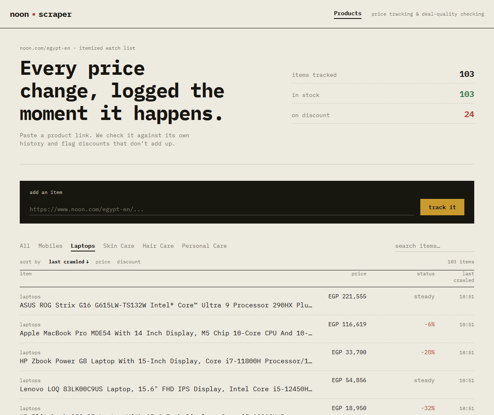
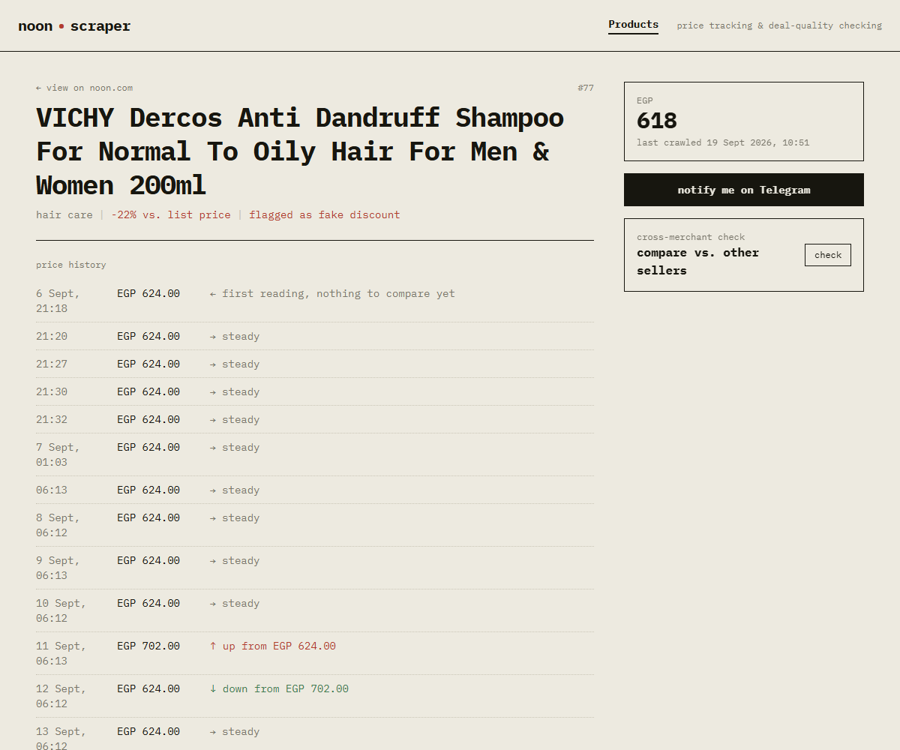
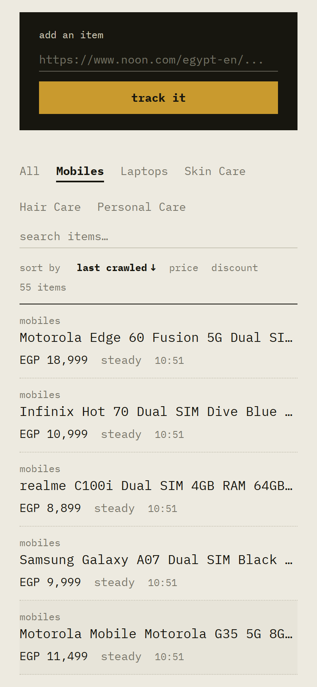
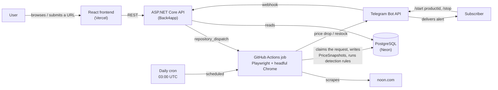
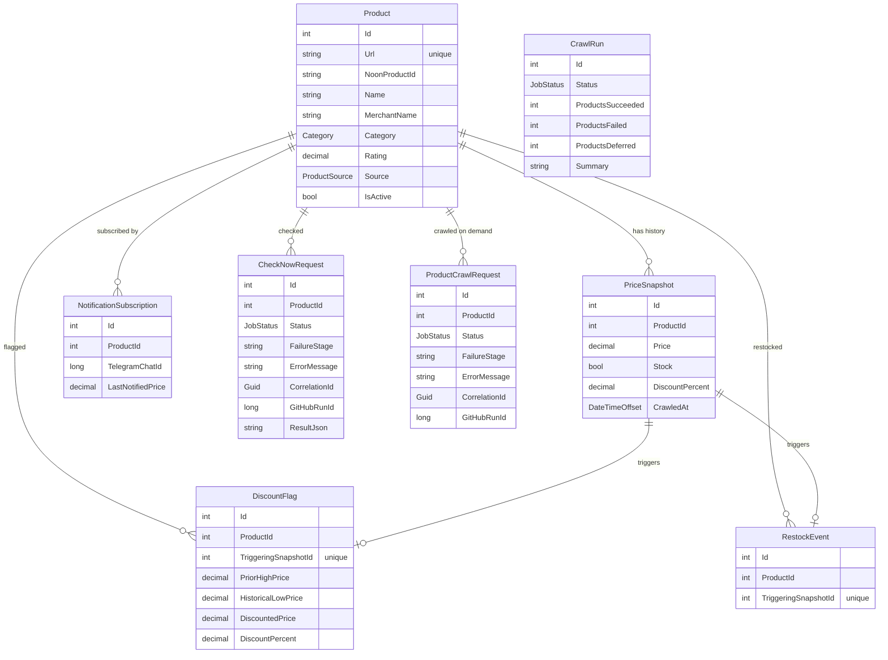

# Noon Scraper

A full-stack data platform that scrapes live product listings from [noon.com](https://www.noon.com) — the largest e-commerce platform in the MENA region — normalizes and persists them, then runs rule-based analysis over the resulting price history to surface restocks and discounts that don't hold up against a product's own past prices. An ASP.NET Core API exposes that data to a React frontend, a Telegram bot pushes alerts when something changes, and a GitHub Actions pipeline handles every part of the pipeline that needs a real, stealth-configured browser — because the API's own hosting has no browser available to it at all. Because GitHub Actions is an unreliable trigger (no guaranteed delivery, no exactly-once), the system is built around a database that holds the truth: idempotent requests, atomic claims, expiry, and failure isolation — with the gaps written down rather than hidden.

This is not a script that dumps scraped rows into a table. It's a system with a normalized relational schema whose concurrency rules are enforced by the database, a rule engine over time-series price data, an on-demand cross-merchant comparison feature that scrapes live rather than reading a cache, and a deliberate infrastructure split (API vs. browser-capable background jobs) driven by a real hosting constraint. Details below are checked against the code and the tests, and the limits are stated in [`Backend/docs/known-limitations.md`](Backend/docs/known-limitations.md).

**Live demo:** [noon-scraper-phi.vercel.app](https://noon-scraper-phi.vercel.app) · **API:** the current URL is tracked in [`Backend/README.md`](Backend/README.md) (it changes — see [`Backend/docs/hosting.md`](Backend/docs/hosting.md) for why, and don't be surprised if it's stale)

[](https://github.com/alieldeenahmed/Noon-Scraper/actions/workflows/ci.yml)      

## Screenshots

**Product list** — server-side search, category filter, sortable columns, and pagination over the tracked set:



**Product detail** — every crawl kept as a price-history log, with the fake-discount flag surfaced next to the product's own history (this product swung from EGP 624 to 702 and back, with 5 flagged discounts):



**Mobile** — the same list on a phone-width viewport:



Captured from a local run against the real database; the data is real scraped noon.com data.

## Overview

The system tracks two kinds of products: five seeded category pages (Mobiles, Laptops, Skin Care, Hair Care, Personal Care) crawled on a daily schedule, and any product a user submits by URL, crawled immediately on submit and then kept up to date by the same daily job. Every crawl writes a new `PriceSnapshot` rather than overwriting the last one, so each product accumulates real history — that history is what the restock and fake-discount rules run against, and what the frontend renders as a price log.

Two things make this more than "scrape a page, show the data": the analysis is genuinely rule-based over stored history (not a snapshot-in-isolation heuristic), and the API itself never touches a browser — every scrape, scheduled or on-demand, is delegated to a GitHub Actions job, because the free hosting tier the API runs on has no headful-Chrome capability. That split is the main architectural decision in this codebase, and it shows up in almost every backend design choice below.

## Key Features

**Data Collection**
- Scheduled daily crawl of five product categories, plus a re-crawl of every user-submitted product on the same schedule
- Immediate, on-demand crawl the moment a user submits a new product URL, instead of waiting for the next scheduled pass
- Stealth-configured, real (headful) Chromium via Playwright — the target site hard-blocks headless Chrome at the network layer, documented in the engineering log
- Product identity normalized against Noon's per-session tracking query strings, so the same product isn't recorded as a new row every crawl

**Price Intelligence**
- Fake-discount detection: flags a claimed discount when the "before" price was itself an inflated recent spike over the product's historical low, rather than trusting the advertised percentage
- Restock detection: recorded the moment a tracked product's most recent snapshot flips from out-of-stock to in-stock
- Both are plain threshold checks against stored `PriceSnapshot` history — no ML, and every decision is traceable to the specific snapshot that triggered it

**Cross-Merchant Comparison**
- On-demand "check now" scrape that finds every seller currently offering a tracked product and returns them sorted by price
- Runs as a real live scrape (not a cached read) via the same GitHub Actions pipeline as the daily crawl, polled to completion by the client

**Notifications**
- Telegram bot subscription via a deep link (`/start <productId>`), so Telegram — not a form — supplies the chat ID
- Alerts sent on a genuine price drop or restock, with a baseline price captured at subscribe time so the first crawl after subscribing can't misfire
- `/stop` unsubscribes a chat from every product at once

**Reliability**
- Job requests have a real lifecycle (`Pending → Running → Completed | Failed`) enforced with atomic conditional updates; a duplicate GitHub delivery, a double-click, and two simultaneous submissions each do the safe thing, and each has a test
- Anything nobody finishes is expired to `Failed` with a stage and a public-safe reason; the GitHub run id and a correlation id are stored and logged so a failure can be traced from product to job to stage
- The daily crawl isolates failures per category and per product, commits each reading on its own, has a time budget, refuses to overlap itself, and turns the workflow red on an explicit policy

**Backend**
- Three-project solution separating shared data access, the API, and the Playwright-driving crawler, so the API has zero browser dependency
- A `ProductRecorder` shared by the daily crawl, the on-demand crawl, and user-added re-crawls: one transaction per reading behind a per-product advisory lock, notifications after the commit
- Strict URL validation (`NoonUrl`) and database-backed budgets on the endpoints that spend GitHub Actions minutes
- Server-side search, sorting, category filtering, and pagination on the product list, plus a stats endpoint for the headline counts
- 663 backend tests on real PostgreSQL (609 without a browser) and 87 frontend tests, run in CI on every push and PR — including the Playwright scrapers, run against saved noon.com markup

**Frontend**
- Product list with debounced search, category filters, sortable columns (price, discount, last crawled), and a pager — all driven by the API
- A product page that waits on a freshly-submitted product's crawl, and shows why it failed (with a link to the workflow run) instead of spinning
- Every API response validated against a `zod` contract that is also tested against the JSON the real API produces
- Price history rendered as a chronological log, plus a cross-merchant comparison panel

## Architecture



The boundary that matters here is the one between the API and the crawler. `NoonScraper.Api` has no reference to Playwright at all — it's a plain, Chrome-free ASP.NET Core app, which is what let it deploy to a free hosting tier with no browser support. Every action that needs a real browser (the daily crawl, an on-demand cross-merchant check, an immediate crawl on submit) is instead handed to `NoonScraper.Crawler`, invoked as a GitHub Actions job — triggered either by the daily cron schedule or by a `repository_dispatch` event the API fires via `GitHubDispatchService`. The API writes a request row (`Pending`) and returns immediately; the worker *claims* it, does the scrape, and marks it `Completed` or `Failed`; the frontend polls until it's finished. Because the trigger is unreliable, the database rather than the workflow decides what is true — see [Backend Architecture](#backend-architecture) and [`Backend/docs/architecture.md`](Backend/docs/architecture.md). `Backend/docs/check-now.md` and `crawl-on-submit.md` cover the two flows in more depth, and `engineering-log.md` #11 explains why it wasn't built this way from the start.

## Tech Stack

| Layer | Technology | Purpose |
|---|---|---|
| Backend | ASP.NET Core (.NET 9) | REST API — read endpoints, product submission, webhook receiver |
| Frontend | React 19 + TypeScript + Vite | Single-page UI, two routes (list, detail) |
| Styling | Tailwind CSS v4 | Utility-first styling, no separate PostCSS config |
| Database | PostgreSQL (Neon) | Persists products, price history, subscriptions, flags |
| ORM | EF Core + Npgsql | Schema, migrations, querying |
| Scraping | Playwright (.NET), headful Chromium | Category and product-page scraping, cross-merchant offer scraping |
| Automation | GitHub Actions | Scheduled daily crawl; on-demand crawl and cross-merchant check via `repository_dispatch` |
| Notifications | Telegram Bot API | Webhook-based subscribe/unsubscribe, outbound alerts |
| Rate limiting | ASP.NET Core `RateLimiter` (built in) + database-backed budgets | In-process per-IP and combined caps; budgets counted from rows for the metered GitHub-dispatching endpoints |
| Testing (backend) | xUnit · `WebApplicationFactory` · real PostgreSQL (embedded locally, service container in CI) · Playwright | Rule and parsing unit tests; job and recorder tests against a real database; API integration tests on the real pipeline; scraper tests in a real browser against saved markup — see [Testing](#testing) |
| Testing (frontend) | Vitest · React Testing Library · zod | Component behaviour against a stubbed `fetch`, and the API contract validated against fixtures from the real API |
| CI | GitHub Actions (`ci.yml`) | Backend build + test (with a Postgres service), frontend lint + test + build on every push/PR |
| Linting | oxlint | Frontend lint (`npm run lint`) |
| Hosting | Back4app (API, Docker) · Vercel (frontend) | Both free, card-free tiers |

## Backend Architecture

The backend is three .NET projects with one clear separation: **`NoonScraper.Data`** holds the EF Core models, `AppDbContext`, and everything that needs neither a browser nor a web framework — `NoonUrl` (what a product link is), `PriceHistoryAnalyzer` (restock / fake-discount rules), `JobLifecycle` (the request state machine), and the subscriber notification code. **`NoonScraper.Api`** is the ASP.NET Core Web API: two controllers, `JobRequestService` and `GitHubDispatchService` for creating and dispatching work, rate limiting, and no Playwright reference anywhere in the project. **`NoonScraper.Crawler`** is a console app that references `NoonScraper.Data` and Playwright; it has three entry points — the daily crawl (no arguments), `crawl-product <requestId>` and `check-now <requestId>` — plus `fail-request` for a workflow to close a request it couldn't run. The three converge on one `ProductRecorder`, and the jobs talk to a small `IScrapeSession` interface rather than to Chrome, which is what lets their failure handling be tested without a browser. [`Backend/docs/architecture.md`](Backend/docs/architecture.md) has the boundaries and the reasoning.

**Why GitHub Actions is the browser worker — and what that costs.** The constraint is real: the target site blocks headless Chrome, so scraping needs headful Chrome on a virtual display, and the free API hosting has no such thing. A queue-plus-worker service (RabbitMQ / Redis / Service Bus and a container running Chrome) is the textbook answer and would mean paying for and operating a second always-on service for work that happens a few times a day. GitHub Actions gives an isolated Chrome-capable machine per job, a scheduler and a job queue for free — but not guaranteed delivery, exactly-once execution, or a way to ask whether anyone picked a job up. So the design doesn't assume any of that: **the database is the source of truth and the workflow is an unreliable trigger.** A request row is written before dispatch; one active request per product is a partial unique index; the worker claims a request with one conditional `UPDATE`, so a duplicate delivery does nothing; `Pending → Running → Completed | Failed` are real states; and anything nobody finishes within 15 minutes is expired to `Failed` with a reason. What that doesn't give is redelivery of a lost dispatch — a real queue would — and that's stated plainly in the [known limitations](Backend/docs/known-limitations.md).

**One reading, one transaction.** `ProductRecorder` (which replaced the static `ProductUpserter`) takes a Postgres advisory lock on the product's URL, then in one transaction finds-or-creates the product, appends a `PriceSnapshot`, runs the restock and discount rules against the history it can now see, and writes the flag or event. Notifications go out after the commit, each one claimed with a conditional update first so two overlapping crawls can't both send it. That is what makes the scheduled crawl overlapping an on-demand one, or a timed-out job retried while its predecessor is alive, safe rather than hopeful.

**Failure isolation.** The daily crawl treats every category and every product as its own unit: a failure is caught, logged with its URL, counted, and the run moves on; each reading commits on its own; the run has a time budget and defers the rest oldest-first; a `CrawlRuns` row with a unique index refuses overlapping runs; and the exit code is an explicit policy (red for a failed category or a ≥ 20 % product failure rate, not "green unless it crashed"). Scrape failures are typed — parse, no-data, navigation — which decides whether a retry is worthwhile and what the user is told, and only a sanitized description ever reaches the public API. See [`Backend/docs/failure-model.md`](Backend/docs/failure-model.md).

Dependency injection is plain ASP.NET Core built-ins (`AddDbContext`, `AddHttpClient`, constructor injection via primary constructors) — no additional container. Configuration reads through one `SettingsExtensions` class: the standard nested key first (`Telegram:BotToken`), then a flat environment variable (`TELEGRAM_BOT_TOKEN`), because Back4app's environment-variable UI rejects the double-underscore naming .NET expects.

Input validation is deliberately strict where it matters. `NoonUrl` accepts only `https` links to exactly `noon.com` / `www.noon.com` (no userinfo, no port, host compared on its punycode form) whose path looks like a product page, checked as the user wrote it; everything after that works with the canonical URL rebuilt from the parsed parts, never the raw string. Duplicates return `409` with the existing product's id — including the same item under a different language's page. List parameters are validated (`400` for an unknown sort, clamping for paging), route ids are integers, and check-now results are looked up by both request id and product id. Errors are RFC 7807 problem bodies with a trace id and no exception text. [`Backend/docs/security-model.md`](Backend/docs/security-model.md) covers the model, including why there is no API key.

The product list is paged, searched, and sorted in the database: each product is projected together with its latest `PriceSnapshot`, filtered and ordered on that projection, and only the requested page is materialized. Products with no value for the sorted field sort last in either direction, and ties break on `Id` so pages never repeat or skip rows. A test counts the SQL commands an endpoint issues and asserts the count doesn't grow with the number of rows, so an N+1 can't creep in.

**Two layers of limits.** In-process rate limiting (`Services/RateLimiting.cs`) gives fixed one-minute windows — every request per client IP (300) and combined (3000), and the endpoints that dispatch GitHub Actions runs per IP (5) and combined (30). It is a first line of defence only: it lives in memory, resets on restart, and the per-IP part depends on a client IP that behind the hosting proxy comes from a forgeable `X-Forwarded-For`. The limits that actually protect the metered resource are **in the database** (`JobRequestService`): 30 dispatches per hour, 20 new products per hour, 500 user-added products in total. They survive restarts, hold across instances, and don't read a header at all.

CORS is environment-aware: in `Development`, any `localhost` origin is trusted regardless of port; outside it only the deployed Vercel origin is allowed.

## Data & Database Design



Rules that must hold under concurrency are enforced by the database, and the code only handles the case where the database says no: `Product.Url` is unique; `ProductCrawlRequest` and `CheckNowRequest` each have a **partial** unique index allowing one row per product with `Status IN (Pending, Running)`; `CrawlRuns` has a partial unique index allowing one `Running` row; `NotificationSubscription` is unique on `(ProductId, TelegramChatId)`; `DiscountFlag` and `RestockEvent` are unique on `TriggeringSnapshotId` (a flag or event traces back to the exact snapshot that caused it, and can only be raised once for it); and every child table cascades on `Product` delete. `PriceSnapshot` is append-only — a crawl never updates a prior snapshot — and is indexed on `(ProductId, CrawledAt)` for the history access pattern.

The schema evolved across four migrations. The latest (`JobLifecycleAndIntegrityConstraints`) adds the new columns and constraints, and first cleans up data that would violate them: it closes still-`Pending` requests, and removes duplicate flags and events. A test builds a database at the previous migration, inserts representative legacy rows, and applies the latest one — `dotnet ef migrations` succeeding on an empty database proves little. **It has not been applied to the production database**; apply it before deploying the new API and crawler (see [known limitations](Backend/docs/known-limitations.md)).

## Scraping Pipeline

```
noon.com
  ↓  Playwright + headful Chromium, stealth init script
CategoryScraper (listing pages) / ProductPageScraper (detail pages)
  ↓  extraction
CategoryScraper reads data-qa attributes off listing tiles;
ProductPageScraper parses the page's schema.org JSON-LD block instead of the DOM
  ↓  parsing (pure functions, no browser)
PriceText / ProductJsonLd turn text and JSON-LD into validated values
  ↓  normalization
NoonUrl.Canonicalize strips tracking query params → stable product identity
  ↓  persistence (one transaction, per-product advisory lock)
ProductRecorder: find-or-create Product, append PriceSnapshot,
PriceHistoryAnalyzer runs restock / fake-discount checks against prior snapshots
  ↓  after commit
SubscriptionNotifier claims and sends Telegram alerts
  ↓  API
ASP.NET Core reads the resulting rows
  ↓  frontend
React polls/fetches and renders price history, flags, and restock events
```

Two extraction strategies are used deliberately, not interchangeably: category listing pages expose stable `data-qa` attributes on each product tile, so `CategoryScraper` reads those directly. The product **detail** page has no such attributes for name or rating, and the merchant name only exists in a hydrated DOM behind build-hashed CSS class names that could change on any frontend redeploy — so `ProductPageScraper` parses the page's embedded `schema.org` `Product` JSON-LD block, which gives clean name, SKU, price, discount, rating, seller, and real stock-availability data in one structured object. `OfferScraper` (used only for the on-demand cross-merchant check) reads the single default offer straight from that same JSON-LD when a product has one seller, and only interacts with the DOM to expand and read the "other sellers" panel when one exists.

Headless Chrome is not an option here — the target site returns a hard connection-layer failure for headless requests, documented in the engineering log — so every environment that runs the crawler launches a real, visible Chromium under a virtual display (`xvfb-run` in CI). A stealth init script (`StealthBrowser`) overrides `navigator.webdriver`, fakes `window.chrome.runtime`, and populates `navigator.plugins`/`languages` to avoid the cheapest static automation fingerprints — this defeats static detection, not behavioural analysis.

Failure handling is per item, not per run, and is described in full in [`Backend/docs/failure-model.md`](Backend/docs/failure-model.md). In short: a category or product that fails is counted and skipped; transient failures (timeouts, blocks, an empty interstitial page) are retried once on a *reset* page while parse errors and 404s are not; the on-demand jobs record `Failed` with the stage and a public-safe message rather than staying `Pending`; and the workflows themselves close their request if they die before the crawler can.

## API

There is no authentication — deliberately, for a public demo (see [`security-model.md`](Backend/docs/security-model.md) for what protects the metered resources instead). Routes are grouped by feature below; see `Backend/README.md` for the full reference table.

**Products**
- `GET /api/products` — one page of tracked products, each with its latest price/stock/discount already joined in. Query parameters: `category`, `search` (case-insensitive substring of the name, or the URL for products not yet crawled), `sortBy` (`crawled` \| `price` \| `discount`, default `crawled`), `sortDir` (`asc` \| `desc`, default `desc`), `page` (default 1), `pageSize` (default 25, max 100). Returns `{ items, total, page, pageSize, totalPages }`.
- `GET /api/products/stats` — `{ total, inStock, onDiscount }` for the headline counts, optionally scoped with `?category=`
- `GET /api/products/{id}` — full detail for one product, including the latest-snapshot fields and a `crawl` block: the state of its most recent on-demand crawl (`Pending` / `Running` / `Completed` / `Failed`, the stage and public-safe reason if it failed, and a link to the GitHub run)
- `POST /api/products` — submit `{ "url": "..." }` to track. Validates it strictly (`400` with the reason), rejects an already-tracked product with `409` and its id, applies the new-product limits (`429`), inserts a bare record, and requests an immediate crawl. The product is saved even if the crawl can't be started — the `201` says so in its `crawl` block.
- `GET /api/products/{id}/history` — every `PriceSnapshot` for a product, oldest first
- `GET /api/products/{id}/discount-flags` — every fake-discount flag, most recent first
- `GET /api/products/{id}/restocks` — every restock event, most recent first

**Cross-merchant check**
- `POST /api/products/{id}/check-now` — idempotent per product: while a check is active it returns that check instead of starting another. `202` with a request id; `429` when the hourly dispatch budget is spent; `502` if GitHub can't be reached.
- `GET /api/products/{id}/check-now/{requestId}` — poll for the result. `Pending → Running → Completed | Failed`; once `Completed`, every seller's offer sorted lowest-price-first; a failure includes its stage and a link to the workflow run.

**Telegram**
- `POST /api/telegram/webhook` — receives Telegram's updates, authenticated by a shared secret header (fail-closed: `503` outside Development until one is set). Handles `/start <productId>` (subscribe) and `/stop` (unsubscribe from everything), in private chats only.

## Frontend

The frontend is two routes (`/` and `/products/:id`) under one `Layout`, with no data-fetching or state-management library — `src/api/client.ts` is a small `fetch` wrapper, one function per endpoint, and each page manages its own state with `useState`/`useEffect`. The API contract is written once, as `zod` schemas in `src/api/schemas.ts`; the TypeScript types are inferred from them and **every response is validated against its schema** at the boundary, so a backend change shows up as a clear "unexpected response" error rather than an `undefined` three components away. The backend pins the JSON its real API produces into fixture files, and a frontend test parses those same fixtures with the schemas, so a DTO change fails one side's tests in CI.

`ProductListPage` holds the query state (category, search, sort key/direction, page) and sends it to the API on every change: search is debounced (300 ms), changing any filter or sort resets to page 1, and a stale response is discarded if a newer query has superseded it. `ProductDetailPage` polls while a freshly submitted product has no crawl data, showing the crawl's real state (queued, crawling) with an elapsed-time estimate — and if the crawl failed it stops polling and shows the reason, the stage, and a link to the workflow run instead of spinning until a timeout. `CheckNowPanel` polls the check-now endpoints the same way and stops when it unmounts. `NotifyMeButton` links out to `https://t.me/<bot>?start=<productId>` rather than collecting input, since Telegram supplies the chat id.

## Testing

**663 backend tests** (xUnit; counted from `dotnet test`, theory rows included — 609 without a browser, 54 that drive Chrome) and **87 frontend tests** (Vitest + React Testing Library). All pass locally on a Release build.

| Area | Tests | What's covered |
|---|---|---|
| Database integrity (real PostgreSQL) | 27 | Every unique / partial-unique index and cascade provoked directly, including concurrent inserts; the latest migration applied to a database with representative legacy data; the hot queries shown to be able to use their indexes (`EXPLAIN` with sequential scans off — proves an index can serve the query, not what the planner does at production size) |
| Job lifecycle | 25 | Every state transition and its guard, stale expiry, the read-time view, races between a worker finishing and the API expiring |
| `ProductRecorder` | 17 | Create vs update; restock / discount from real crawl sequences; two crawls of one product at once; losing a race with the API's insert; a failure part-way leaving nothing behind |
| `SubscriptionNotifier` | 16 | Silent baseline, drop / restock alerts, no-drop stays quiet, a claim so two crawls can't both send, a failed send releases it |
| Dispatched jobs (`CheckNowJob`, `CrawlProductJob`) | 29 | Success; failure at each stage; duplicate delivery claims nothing; timeout and cancellation still record an outcome; a late result is discarded; correlation ids on log lines |
| `DailyCrawl` | 40 | One failing category/product doesn't stop the run; a failed DB write doesn't poison later products; transient retry vs permanent; time budget deferral; overlap refusal; dead-run expiry; cancellation keeps committed work; the exit-code policy |
| GitHub dispatch | 25 | Payload, retry on 5xx / 429 / secondary rate limit, none on real 403 / 404, backoff, giving up, missing token |
| API (real pipeline + Postgres) | 78 | Paging, sort with nulls last, search, filters, stats, validation, idempotent submit / check, concurrent submissions, dispatch failure, budgets, an N+1 guard on query counts |
| Telegram webhook | 65 | Secret required and constant-time, private chats only, malformed / hostile payloads, subscription cap, duplicate and simultaneous starts, `/stop` |
| Rate limiting | 11 | Per-IP and combined caps, spoofed IPs, `Retry-After`, CORS on a `429`, limits shared by two app instances on one database |
| URL validation + normalization | 114 | `NoonUrl` accepts real links (including Arabic slugs) and rejects lookalike hosts, userinfo, ports, whitespace and zero-width characters, path tricks, junk in segments; tracking-param stripping |
| Parsing | 124 | `PriceText` and `ProductJsonLd`: separators, Arabic digits, missing / zero / negative / wrong-type prices, several JSON-LD blocks, offers as list, discount and stock derivation |
| `PriceHistoryAnalyzer` | 31 | Restock rule and fake-discount rule, including boundaries and edge cases |
| API contract | 7 | Real API responses pinned against fixture files the frontend also parses |
| Scrapers (Chrome, saved markup) | 54 | Listing tiles, product-page JSON-LD, the "other sellers" panel, and their failure modes, in a real browser with the network cut off |

Backend tests that touch the database run on **real PostgreSQL** — an embedded server locally, a service container in CI — because the claims worth testing (unique and partial indexes, advisory locks, foreign keys, transactions, concurrent writers) are exactly what EF Core's in-memory provider doesn't enforce. Each test gets its own database cloned from a migrated template.

The frontend tests render the real components against the real API client with `fetch` stubbed: submission and its failure statuses, waiting on a crawl (including a failed one), the cross-merchant check, price-history rendering, sort / filter / paging, and the race where a slow response must not overwrite a newer one.

Things worth knowing about how far to trust this: the scraper fixtures are static snapshots, so they catch a scraper regression but cannot notice Noon changing its live markup; the frontend tests run in jsdom, so they cover behaviour and states, not layout; code coverage isn't measured; and I checked that the scraper tests can fail by breaking the discount selector, the seller-price selector and the `>` in the discount rule, before the parsing refactor rather than after. Writing the tests found real bugs — the `evilnoon.com` host check (`engineering-log.md` #16), several holes in URL validation (#22), and two mistakes in my own test harness that made concurrency tests pass or fail for the wrong reason (#19). See [`Backend/docs/scraper-testing.md`](Backend/docs/scraper-testing.md) for the strategy.

## CI/CD

Four GitHub Actions workflows. One is a code-quality gate; the other three are compute infrastructure for scraping:

- **`ci.yml`** — runs on every push to `main` and every pull request (skipping docs-only changes). A backend job starts a PostgreSQL service container, builds the solution in Release and runs the full test suite (including the Chrome-driven scraper tests, using the Chrome on GitHub's Ubuntu runners); a frontend job runs `npm ci`, oxlint, `npm test`, and `npm run build` (which type-checks with `tsc -b`). No secrets needed.
- **`daily-crawl.yml`** — a `0 3 * * *` UTC cron (plus manual `workflow_dispatch`); builds the crawler, installs Chrome and Playwright's system dependencies, and runs the full crawl under `xvfb-run`. A `concurrency` group stops a manual run overlapping a scheduled one, and the run goes red on the exit-code policy above.
- **`check-now.yml`** / **`crawl-product.yml`** — triggered by `repository_dispatch` from the API. The run is named with the request id, product id and correlation id; one run per product at a time; the request id is validated before use rather than spliced into a shell command; and a final `failure() || cancelled()` step closes the request if the workflow died before the crawler could.

The three scraping workflows share a runner setup (`ubuntu-24.04`, pinned rather than `ubuntu-latest` after a Playwright compatibility break) and cache NuGet packages and the Playwright browser build.

## Project Structure

```
Noon-Scraper/
├── .github/workflows/          # ci, daily-crawl, check-now, crawl-product
├── docs/screenshots/           # images used in this README
├── Backend/
│   ├── NoonScraper.Data/       # EF Core models, AppDbContext, migrations, NoonUrl,
│   │                           # PriceHistoryAnalyzer, JobLifecycle, notifications
│   ├── NoonScraper.Api/        # Controllers, Dtos, Services (no Playwright): job requests,
│   │                           # GitHub dispatch, rate limiting
│   ├── NoonScraper.Crawler/    # Playwright scrapers, StealthBrowser, ProductRecorder,
│   │                           # Jobs/ (DailyCrawl, CrawlProductJob, CheckNowJob)
│   ├── NoonScraper.Tests/      # xUnit on real PostgreSQL + Chrome fixtures; Contracts/
│   ├── docs/                   # architecture, failure model, security model, scraper
│   │                           # testing, known limitations, hosting, engineering log, ...
│   └── Dockerfile
└── Frontend/
    ├── src/api/                # zod schemas, inferred types, validated fetch client
    ├── src/components/         # AddProductForm, CheckNowPanel, NotifyMeButton, ...
    ├── src/pages/              # ProductListPage, ProductDetailPage
    └── src/test/               # test setup, factories, fetch stub
```

## Getting Started

### Prerequisites

- [.NET 9 SDK](https://dotnet.microsoft.com/download)
- Node.js (for the frontend)
- A [Neon](https://neon.tech) PostgreSQL project (or any reachable Postgres instance) to run the app; **the tests need no database of their own** — they download and start an embedded PostgreSQL on first run (or use the server in `NOON_TEST_POSTGRES`, with rights to create databases)
- To actually run the crawler (not just the API): a Linux environment with a display — WSL2 with Ubuntu 24.04 is what this project uses locally, since headless Chrome doesn't work against this target (see the engineering log)

### Backend

From the repository root:

```bash
cd Backend/NoonScraper.Api
dotnet user-secrets set "ConnectionStrings:DefaultConnection" "<your Postgres connection string>"
dotnet tool restore
dotnet ef database update --project ../NoonScraper.Data --startup-project .
```

Set the same `ConnectionStrings:DefaultConnection` secret in `Backend/NoonScraper.Crawler` too if you'll run the crawler. Telegram notifications are optional — without `Telegram:BotToken` / `Telegram:WebhookSecret` the app runs fine and notifications are silently skipped (the webhook itself refuses requests outside Development until a secret is set).

```bash
cd Backend

dotnet test                                # first run downloads an embedded PostgreSQL; the scraper tests need Chrome installed
dotnet test --filter "Category!=Browser"   # the 609 tests that don't need a browser
dotnet run --project NoonScraper.Api       # http://localhost:5176

# The crawler needs Chrome + Playwright's system dependencies, installed once:
dotnet run --project NoonScraper.Crawler -- install chrome
dotnet run --project NoonScraper.Crawler -- install-deps
dotnet run --project NoonScraper.Crawler   # the scheduled crawl
```

### Frontend

```bash
cd Frontend
npm install
```

Create `Frontend/.env`:

```bash
VITE_API_BASE_URL=http://localhost:5176
VITE_TELEGRAM_BOT_USERNAME=
```

```bash
npm run dev      # the app
npm test         # the frontend tests
```

See [`Backend/README.md`](Backend/README.md) and [`Frontend/README.md`](Frontend/README.md) for the full setup — including the `DATABASE` GitHub Actions repository secret the workflows need, and the API's own `GitHubDispatch:Token` config value (a fine-grained GitHub PAT) — both required for the on-demand/scheduled crawl features to work end-to-end rather than just running the API against an empty database.

## Engineering Decisions

- **Why the API never launches a browser, and why the workaround is GitHub Actions rather than a queue:** it originally did — `check-now` first shipped as a synchronous in-process scrape, which needed a headful-Chrome-capable runtime and ruled out nearly every free hosting tier. Moving all scraping into GitHub-Actions-triggered jobs made the API a plain, Chrome-free ASP.NET Core app. A real queue and worker would be the textbook design and would cost money and an extra service to operate, so instead the database carries the guarantees the trigger lacks (idempotent requests, atomic claims, expiry) and the gaps are documented (`engineering-log.md` #10–#12, #20; [`architecture.md`](Backend/docs/architecture.md)).
- **Why headful Chrome under `xvfb-run` instead of headless:** the target site returns a hard connection-layer failure for headless requests specifically — not a JS challenge, something at the TLS/HTTP2 fingerprint level. Headful Chrome under a virtual display has the same network fingerprint as a real browser, so it works where true headless doesn't.
- **Why product detail scraping reads a JSON-LD block instead of the DOM:** the detail page's DOM has no stable attributes for name/rating and uses build-hashed class names that could change on any redeploy. The page's own `schema.org` data is more stable and also exposes real stock availability.
- **How duplicate products are prevented:** Noon appends a per-session tracking query string to every product URL, so without normalizing it away the same product was inserted as a new row on every crawl (a real bug — 10 duplicate rows for one item). `NoonUrl` strips to scheme + host + path before any write or comparison; a unique index on `Url` is what actually guarantees it, and a concurrent-submission test proves the loser gets a `409`, not a `500` or a second row.
- **How concurrency is handled:** by the database, not by hoping. Partial unique indexes decide "one active request per product" and "one running crawl"; conditional `UPDATE`s decide who claims or finishes a job; an advisory lock serializes writers of one product. Each rule has a test that provokes the race against real PostgreSQL.
- **How price history is stored:** append-only `PriceSnapshot` rows rather than a mutable "current price", because the detection rules and the history log need the full sequence.
- **How scraping failures are handled:** per-item isolation, typed failures that decide retry-or-not, a time budget, an explicit exit-code policy, and a `Failed` status with a stage and a public-safe reason for on-demand requests — rather than crashing the job or leaving a request stuck. The frontend shows that reason and the workflow-run link.
- **Why the product list is paged, searched, and sorted in the database:** the list used to return every tracked product for the browser to filter; the payload was unbounded. The API now returns one page plus a total, with the headline counts on a separate stats endpoint.
- **Why there are limits in the database as well as in the rate limiter:** the in-process limiter is per instance, resets on restart, and trusts a forgeable header for the client IP. The budgets that protect the metered GitHub quota and the crawl workload are counted from database rows, so they hold whatever a caller sends.
- **Why there's no API key:** the app is a public demo, so a key would have to ship in the frontend bundle, where it protects nothing. The endpoints are made safe to leave open instead — idempotent, budgeted, and only able to reach a noon.com product page. ([`security-model.md`](Backend/docs/security-model.md))
- **Why the API contract is checked at runtime and against real fixtures:** no code generator (it would be bigger than the app), but every response is validated with `zod`, and the backend pins the JSON the real API produces so the frontend's schemas are tested against reality rather than against my memory of it.

## What I deliberately didn't claim

There is no authentication or authorization — every endpoint is open, protected by rate limiting and database-backed budgets, and a determined caller can still use the hourly budgets up. There is no redelivery of a lost dispatch, so a request whose workflow never starts is reported failed after 15 minutes rather than retried. The scraper tests use saved snapshots, so they can't detect Noon changing its live markup, and there is no live-site canary. The in-process rate limiter is per instance (this deployment runs one). The latest database migration has been tested against legacy data but **not applied to production**, and code that depends on it must not be deployed before it is. The frontend tests run in jsdom, not a real browser, and coverage isn't measured. Nobody else has reviewed or penetration-tested any of this. The full list, with the reasoning, is in [`Backend/docs/known-limitations.md`](Backend/docs/known-limitations.md).

## License

Licensed under the [MIT License](LICENSE).
