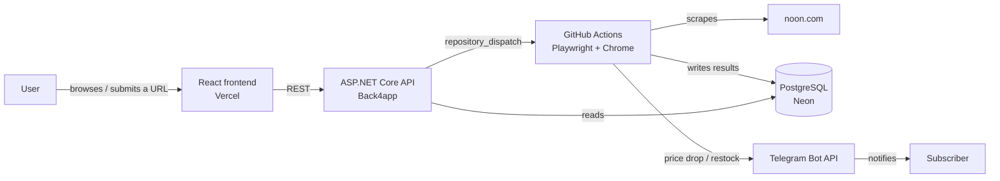

# Noon Scraper

A full-stack price-tracking and deal-quality tool for [noon.com](https://www.noon.com), the largest e-commerce platform in the MENA region. It scrapes real product pages with a real browser, flags restocks and discounts that don't hold up against a product's own price history, compares the same product across sellers on demand, and notifies subscribers on Telegram the moment something changes — all with plain rule-based logic, no AI/ML involved.

**Live demo:** [noon-scraper-phi.vercel.app](https://noon-scraper-phi.vercel.app) · **API:** see [`Backend/README.md`](Backend/README.md) for the current endpoint (it moves — [`Backend/docs/hosting.md`](Backend/docs/hosting.md) explains why)

     

## Why this exists

This started as a scraper targeting TikTok, which got blocked outright by TikTok's anti-bot defenses almost immediately. Rather than abandon the idea, I pivoted to Noon: no official public API, but a realistic mid-difficulty anti-bot target — harder than an open-JSON-API site, easier than the hardest platforms to automate. The goal was never a scraper tech demo; it's meant to be an actually useful tool, so every feature ties back to a real question a shopper would ask: *is this actually back in stock, is this discount real, and is someone else selling it cheaper?*

## What it does

- **Scrapes real product pages** with a real, stealth-configured Chrome instance (headless Chrome is hard-blocked by the target site's anti-bot layer — see the engineering log for how that was diagnosed)
- **Flags fake discounts** by checking a claimed "% off" against the product's own price history, not just trusting the sticker
- **Detects restocks** the moment a tracked item flips from out-of-stock to in-stock
- **Compares prices across sellers** for any tracked product, on demand, via a live scrape rather than stale cached data
- **Crawls a freshly-submitted URL immediately** instead of making the user wait for the next scheduled pass
- **Notifies subscribers on Telegram** the instant a price drops or an item restocks, via a real registered webhook (not a simulated one)
- Everything above is **plain threshold logic over stored history** — deliberately no AI/ML, so every decision the system makes is explainable

## Architecture



The API never launches a browser — it has no Chrome available on its free hosting tier. Both the daily crawl and any on-demand action (submitting a URL, cross-merchant check) run as GitHub Actions jobs instead, the only place a real Chrome instance is available, writing results straight to Postgres. See [`Backend/docs/check-now.md`](Backend/docs/check-now.md) and the [engineering log](Backend/docs/engineering-log.md) for why this shape won out over an in-process scraper.

## Stack

| | |
|---|---|
| **Backend** | .NET 9 · ASP.NET Core Web API · EF Core + Npgsql · PostgreSQL (Neon) · Playwright |
| **Frontend** | React 19 · TypeScript · Vite · Tailwind CSS v4 |
| **Infra** | GitHub Actions (scheduled + on-demand crawling) · Back4app (API) · Vercel (frontend) · Telegram Bot API |

Every hosting piece runs on a genuinely free, card-free tier — see [`Backend/docs/hosting.md`](Backend/docs/hosting.md) for why that constraint shaped several architecture decisions here.

## Structure

```
Noon Scraper/
├── Backend/     # ASP.NET Core API + EF Core models + the Playwright crawler
└── Frontend/    # React + TypeScript UI
```

See [`Backend/README.md`](Backend/README.md) and [`Frontend/README.md`](Frontend/README.md) for setup instructions and full API reference. **[`Backend/docs/engineering-log.md`](Backend/docs/engineering-log.md)** is worth a look on its own — it's a real account of the technical obstacles this project ran into (anti-bot detection, a Windows tooling blocker, a data-integrity bug, the free-hosting search) and how each got diagnosed and fixed.

## License

Licensed under the [MIT License](LICENSE).
