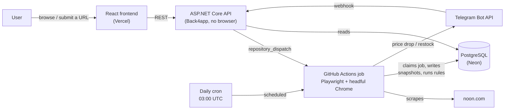
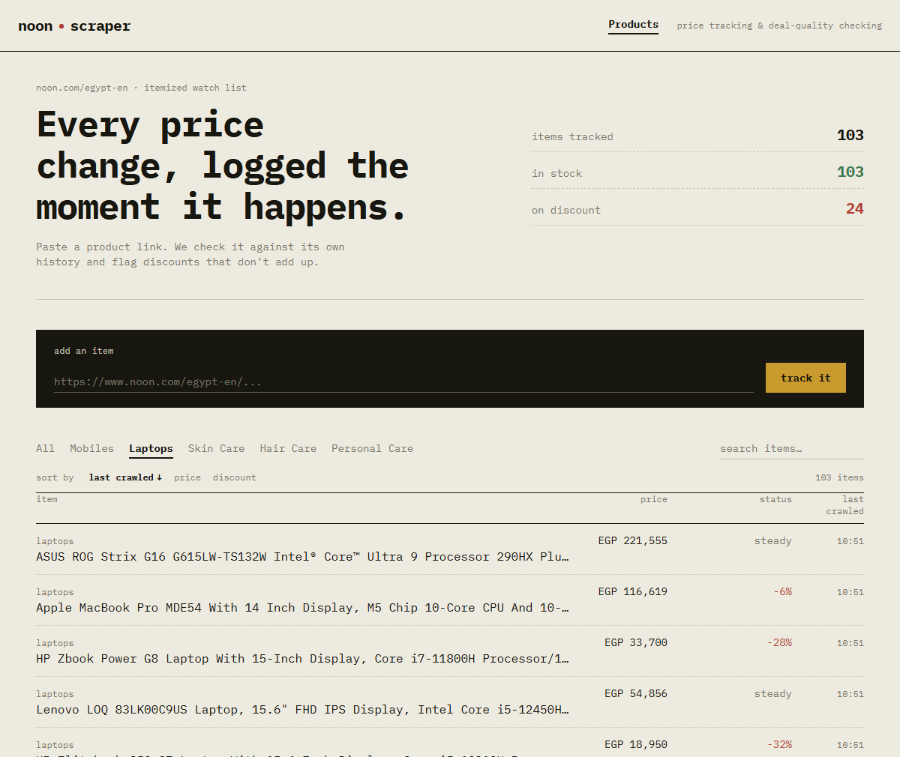
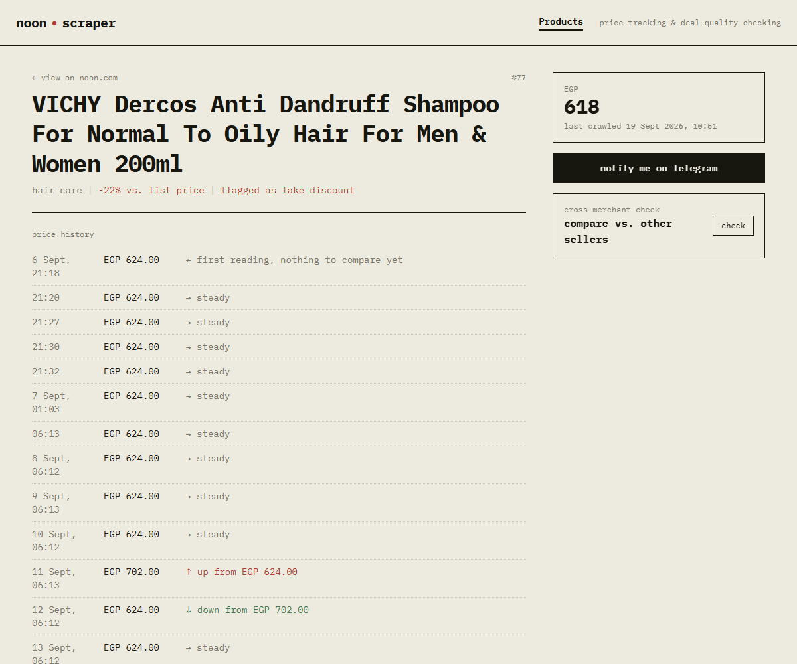
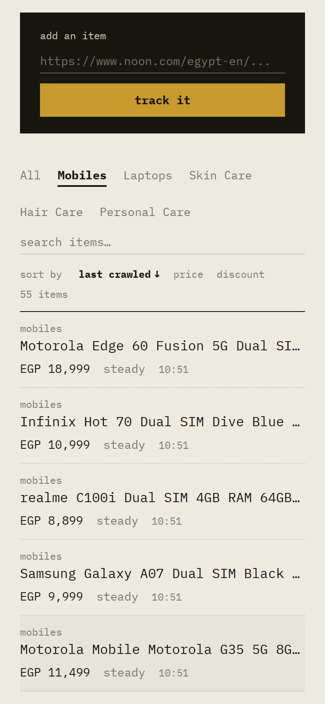

# Noon-Scraper

Automated price-tracking platform built with ASP.NET Core, PostgreSQL, Playwright, and GitHub Actions — where the interesting engineering problem isn't scraping a page, it's coordinating unreliable background jobs safely.

[](https://github.com/alieldeenahmed/Noon-Scraper/actions/workflows/ci.yml)     

**Live demo:** [noon-scraper-phi.vercel.app](https://noon-scraper-phi.vercel.app) · **API:** current URL tracked in [`Backend/README.md`](Backend/README.md) — it changes when the free-tier container is recreated (see [`Backend/docs/hosting.md`](Backend/docs/hosting.md))

## Overview

Noon-Scraper tracks prices and stock for products on [noon.com](https://www.noon.com) (a large MENA e-commerce site) and flags two things a shopper actually cares about: a restock, and a "discount" that isn't real because the "before" price was itself an inflated recent spike. A user pastes a product URL, the system tracks it from then on, and a Telegram bot can push an alert when either happens.

What makes this more than a scraper: the price-history rules run over data actually stored in PostgreSQL, not a single snapshot, and every scrape — scheduled or on a user's request — is a background job with a real lifecycle: claimed once, retried when it makes sense, expired if abandoned, and always ending in a state the API can report honestly. The scraping itself is delegated to GitHub Actions because the API's own hosting has no browser available to it; that constraint is what shapes most of the backend design below.

## Architecture


```mermaid
flowchart LR
    User -->|browse / submit a URL| FE["React frontend<br/>(Vercel)"]
    FE -->|REST| API["ASP.NET Core API<br/>(Back4app, no browser)"]
    API -->|repository_dispatch| GHA["GitHub Actions job<br/>Playwright + headful Chrome"]
    Cron["Daily cron<br/>03:00 UTC"] -->|scheduled| GHA
    GHA -->|scrapes| Noon[noon.com]
    GHA -->|claims job, writes<br/>snapshots, runs rules| DB[("PostgreSQL<br/>(Neon)")]
    API -->|reads| DB
    GHA -->|price drop / restock| TG[Telegram Bot API]
    TG -->|webhook| API
```

Three .NET projects enforce one boundary: **`NoonScraper.Api`** has no reference to Playwright anywhere in the project — it's a plain ASP.NET Core app that writes a job row and returns immediately. **`NoonScraper.Crawler`** is the only project that references Playwright; it's invoked as a GitHub Actions job, claims the job row, scrapes, and writes the result back. **`NoonScraper.Data`** holds the EF Core model and the logic both sides share — the job state machine, the price-history rules, URL validation — with no dependency on either the web framework or a browser. The frontend polls the API until a job's status stops being `Pending`/`Running`.

## Key Features

- **Scheduled + on-demand scraping** — five category pages crawled daily, plus an immediate crawl the moment a user submits a product URL, instead of waiting for the next scheduled pass
- **Job lifecycle with recovery** — every scrape is a database row with a real state machine (below), not a fire-and-forget script
- **Price-history rules over real data** — fake-discount and restock detection run against stored `PriceSnapshot` history, not a single reading; every flag traces back to the exact snapshot that triggered it
- **On-demand cross-merchant check** — a live scrape (not a cache) that returns every seller currently offering a tracked product, sorted by price
- **Telegram alerts** — subscribe via a bot deep link (Telegram supplies the chat ID, not a form); alerts on a genuine drop or restock only
- **Server-side list** — search, category filter, sort, and pagination done in the database, not shipped to the browser as one page

## Engineering Highlights

### Job coordination

A scrape is a row in `ProductCrawlRequest` or `CheckNowRequest` with a real state machine — `Pending → Running → Completed | Failed` — because a GitHub Actions dispatch is a fire-and-forget HTTP call with no delivery guarantee and no way to ask "did anyone pick this up?" Treating it as reliable would mean a lost dispatch leaves a request `Pending` forever, and a re-delivered one runs the scrape twice.

Every transition in `JobLifecycle` is one conditional `UPDATE ... WHERE Status = <expected>`, never read-then-write:

```csharp
// Pending -> Running, only if still Pending. Returns false for a duplicate delivery.
UPDATE ProductCrawlRequests SET Status = Running, StartedAt = @now
WHERE Id = @id AND Status = Pending
```

The affected-row count is the answer: if a second worker claims the same request, it updates zero rows and exits without scraping. `TryFailAsync` and `TryCompleteAsync` follow the same pattern for the other transitions. A request nobody finishes within a configurable window (15 minutes by default) is swept to `Failed` — by the next API request for that product, by the next scheduled crawl, and at read time (`JobLifecycle.View`), so a `GET` never reports "running" for a job that's actually dead. Each failure carries a stage (`dispatch`, `scrape`, `timeout`, …) and a message safe to show publicly.

### Concurrency

Two mechanisms, for two different problems:

- **Partial unique indexes** stop two *jobs* existing for the same work at once — one active (`Pending`/`Running`) request per product, one running scheduled crawl at a time. A second submission or a second scheduled run doesn't get a special code path; it collides with the index and the database resolves it.
- **A PostgreSQL advisory lock** (`pg_advisory_xact_lock`, keyed on the product's URL) serializes *writes* to one product's data, because two crawls of the same product can legitimately overlap — a scheduled run and an on-demand one, or a retried job while its predecessor is still finishing. Without it, both could see stale history and record the same restock twice, or one could write a snapshot without its discount flag if it failed mid-write. The lock, the snapshot insert, the rule evaluation, and the flag/event write all happen inside one transaction, so a failure partway through leaves nothing behind. There is one lock per product, taken in isolation — no cross-resource ordering was needed because no operation ever holds two products' locks at once.

Both are exercised directly: tests provoke the same race against a real PostgreSQL database (concurrent inserts for one product, two overlapping recorders, two scheduled runs started together) rather than asserting on mocked behavior.

### Scraper / API separation

The API has zero browser dependency, deliberately. `check-now` (the cross-merchant check) first shipped as a synchronous in-process scrape, which meant the API needed a headful-Chrome-capable runtime — ruling out nearly every free hosting tier. Moving every scrape into a GitHub-Actions-triggered job made the API a plain, stateless web app that can run anywhere .NET runs, and let the crawler's dependencies (Playwright, a real browser, a virtual display) live somewhere that isn't a public-facing web process.

### Security

Input validation is aimed at the two things that matter for a service whose whole job is fetching URLs: the crawler must never be pointed somewhere other than a real noon.com product page, and the API must never echo internal detail to a caller.

- **Host allow-list, not a substring check.** An earlier version accepted any host that `EndsWith("noon.com")`, which let `evilnoon.com` through — a real bug caught while writing tests. The current check (`NoonUrl`) compares the host's IDN/punycode form against exactly `noon.com` or `www.noon.com`, so a lookalike domain, and a lookalike using non-Latin characters that could visually resemble the real host, both fail. Because the crawler only ever visits the canonical URL rebuilt from the parsed parts — never the string the caller sent — this also closes off using the submission endpoint to make the crawler's browser fetch an arbitrary URL.
- **Raw-path validation.** The path is checked against a segment allow-list *before* `Uri` normalizes it, because `Uri` silently percent-encodes characters like `<`, `>`, `"` and `|` — a check applied after normalization would let them through. Validation also rejects userinfo, non-default ports, and Unicode "format" characters (zero-width, used to make two strings look identical).
- **No exception detail in responses.** Errors return an RFC 7807 problem body with a trace id; the exception itself goes to the log, not the client.

### Rate limiting and budgets

Two independent layers, because they defend against different things:

- **In-process rate limiting** (ASP.NET Core's built-in limiter): 300 requests/minute per client IP and 3,000 combined; 5/minute per IP and 30 combined on the two endpoints that trigger a GitHub Actions run. This is a first line of defence only — it resets on restart, is per-instance, and the per-IP part depends on a client IP that (behind an unknown-depth proxy) comes from a forgeable `X-Forwarded-For` header.
- **Database-backed hourly budgets** (`JobRequestService`): at most 30 dispatched jobs and 20 new products per hour, counted from actual rows, plus a 500-product cap on the total tracked set. These survive a restart, hold across instances, and don't read a header at all — they're what actually protects the metered GitHub Actions quota, with the in-process limiter as a cheap first filter in front of them.

## Automation / CI

Four GitHub Actions workflows: one is a code-quality gate, the other three are how the scraping actually runs (this project has no browser-capable server to run a background service on).

- **`ci.yml`** — build + test on every push/PR. The backend job starts a PostgreSQL service container and runs the full xUnit suite (including the Chrome-driven scraper tests, using the Chrome already on GitHub's Ubuntu runners); the frontend job runs lint, tests, and a production build.
- **`daily-crawl.yml`** — cron `0 3 * * *` (03:00 UTC) plus manual `workflow_dispatch`. Crawls the five tracked categories and every user-added product. A `concurrency` group keeps a manual run from overlapping a scheduled one.
- **`check-now.yml`** / **`crawl-product.yml`** — triggered by a `repository_dispatch` event the API fires when a user requests a cross-merchant check or submits a new product. Each run is named with the request id, product id and correlation id; a `concurrency` group scopes one run per product; the id arrives via an environment variable and is validated as numeric before use rather than interpolated into the shell command; and a final step closes the job's database row if the workflow dies before the crawler can report.

This is a triggered batch job, not a distributed task queue — GitHub Actions gives no delivery guarantee and no way to ask whether a dispatch was picked up, which is exactly why the job-lifecycle work above exists: the database, not the workflow run, is what a client actually gets told the truth from.

## Testing

**690 backend tests** (xUnit, via `dotnet test --list-tests`; 636 run without a browser, 54 drive a real Chrome) plus **89 frontend tests** (Vitest + React Testing Library).

Concurrency and integration tests run against **real PostgreSQL** — an embedded server locally, a service container in CI — not an in-memory fake, because an in-memory provider doesn't enforce unique indexes, partial indexes, or transactions, which is exactly what the concurrency claims above depend on. Each test gets its own database cloned from a migrated template. Coverage includes:

- concurrent submissions of the same product (asserting exactly one row is created, the rest get `409`), two crawls of one product racing under the advisory lock, and two scheduled runs started together (one runs, one exits cleanly)
- every partial unique index and cascade provoked directly, and the latest schema migration applied to a database seeded with representative pre-migration data
- the job state machine's every transition and its guard, stale-request expiry, and the read-time view that reports a dead job as failed before anything has written that down
- security validation: lookalike hosts, userinfo, non-default ports, zero-width characters, and path-smuggling attempts, each as its own test case
- the Telegram webhook against malformed and hostile payloads, and the API's rate limiter under spoofed IPs

The scraper tests run the real scrapers in a real (headless, for CI) Chrome with the network cut off, answering every request with saved noon.com markup — so the production selectors and JSON-LD parsing run for real, not against a mock. Those fixtures are static snapshots: they catch a regression in the scraper's own code but cannot detect Noon changing its live markup, which is stated as a limitation rather than glossed over.

## Technology Stack

**Backend** — ASP.NET Core (.NET 9), C#, EF Core + Npgsql
**Database** — PostgreSQL (Neon), partial unique indexes, advisory locks
**Browser automation** — Playwright (.NET), headful Chromium under `xvfb`
**Automation / CI** — GitHub Actions (`repository_dispatch`, scheduled cron)
**Frontend** — React 19, TypeScript, Vite, Tailwind CSS, `zod` for runtime API-contract validation
**Testing** — xUnit against real PostgreSQL, `WebApplicationFactory`, Playwright; Vitest + React Testing Library

## Screenshots

**Product list** — server-side search, category filter, sortable columns, pagination:



**Product detail** — price-history log with a fake-discount flag surfaced against the product's own history:



**Mobile:**



Captured from a local run against the real database; the data shown is real scraped noon.com data.

**On the live demo:** the API host is a free-tier container that is periodically recreated (see [`Backend/docs/hosting.md`](Backend/docs/hosting.md)); if the "Live" link above is unresponsive, that's the known cause, not a code issue.

## Getting Started

### Prerequisites

- [.NET 9 SDK](https://dotnet.microsoft.com/download)
- Node.js (for the frontend)
- A [Neon](https://neon.tech) PostgreSQL project, or any reachable Postgres instance — **not needed to run the test suite**, which starts its own embedded PostgreSQL on first run (or point `NOON_TEST_POSTGRES` at a server you can create databases on)
- To actually run the crawler (not just the API): a Linux environment with a display — this project uses WSL2/Ubuntu 24.04 locally, since the target site blocks headless Chrome

### Backend

```bash
cd Backend/NoonScraper.Api
dotnet user-secrets set "ConnectionStrings:DefaultConnection" "<your Postgres connection string>"
dotnet tool restore
dotnet ef database update --project ../NoonScraper.Data --startup-project .
```

Set the same connection-string secret in `Backend/NoonScraper.Crawler` if you'll run the crawler locally. Telegram notifications are optional; without `Telegram:BotToken` / `Telegram:WebhookSecret` set, the app runs fine and notifications are silently skipped.

```bash
cd Backend
dotnet test                                # starts an embedded PostgreSQL on first run; scraper tests need Chrome
dotnet test --filter "Category!=Browser"   # the 636 tests that don't need a browser
dotnet run --project NoonScraper.Api       # http://localhost:5176

# to run the crawler locally, one-time Playwright setup:
dotnet run --project NoonScraper.Crawler -- install chrome
dotnet run --project NoonScraper.Crawler -- install-deps
dotnet run --project NoonScraper.Crawler   # the scheduled crawl
```

### Frontend

```bash
cd Frontend
npm install
```

Create `Frontend/.env`:

```bash
VITE_API_BASE_URL=http://localhost:5176
VITE_TELEGRAM_BOT_USERNAME=
```

```bash
npm run dev    # the app
npm test       # the frontend test suite
```

Running the scheduled/on-demand crawl end-to-end (rather than just the API against an empty database) also needs the `DATABASE` GitHub Actions repository secret and the API's `GitHubDispatch:Token` config value (a fine-grained GitHub PAT) — see [`Backend/README.md`](Backend/README.md) and [`Backend/docs/hosting.md`](Backend/docs/hosting.md).

## Project Structure

```
Noon-Scraper/
├── .github/workflows/        # ci, daily-crawl, check-now, crawl-product
├── Backend/
│   ├── NoonScraper.Data/     # EF Core model, migrations, job state machine, URL
│   │                         # validation, price-history rules — no web, no browser
│   ├── NoonScraper.Api/      # Controllers, job creation + dispatch, rate limiting —
│   │                         # no Playwright reference anywhere in the project
│   ├── NoonScraper.Crawler/  # Playwright scrapers, the recorder, the three job types —
│   │                         # the only project that touches a browser
│   ├── NoonScraper.Tests/    # xUnit on real PostgreSQL, plus Chrome-driven scraper tests
│   └── docs/                 # architecture, failure model, security model, and more
└── Frontend/
    ├── src/api/              # zod schemas (the API contract), validated fetch client
    ├── src/components/       # AddProductForm, CheckNowPanel, NotifyMeButton, ...
    └── src/pages/            # ProductListPage, ProductDetailPage
```

Deeper write-ups live in [`Backend/docs/`](Backend/docs): [`architecture.md`](Backend/docs/architecture.md), [`failure-model.md`](Backend/docs/failure-model.md), [`security-model.md`](Backend/docs/security-model.md), [`scraper-testing.md`](Backend/docs/scraper-testing.md), and an [`engineering-log.md`](Backend/docs/engineering-log.md) of real problems hit and how each was diagnosed.

## Security Notes

There is no authentication anywhere in this API — every endpoint is open, which is a deliberate choice for a public demo with no user accounts, not an oversight. What's actually implemented to bound what an anonymous caller can do:

- A host allow-list on submitted URLs (exactly `noon.com`/`www.noon.com`, compared on the punycode form), so the crawler's browser can never be pointed at anything else
- Path validation performed before URL normalization, so characters that normalization would otherwise percent-encode can't slip past a filter checking the normalized form
- Rejection of userinfo, non-default ports, and invisible Unicode characters in a submitted URL
- A fail-closed Telegram webhook (refuses every request outside local development until a shared secret is configured) with a constant-time secret comparison
- Two independent layers of throttling — an in-process rate limiter and database-backed hourly budgets — described under Engineering Highlights above
- RFC 7807 error responses with a trace id, never exception detail

This is not a claim of general security review or penetration testing; it's a list of the specific defenses actually in the code, each with a passing test.

## Limitations

Stated plainly rather than hidden:

- **No delivery guarantee from GitHub Actions.** A lost dispatch is not retried automatically — it's detected and reported as failed once its time window expires, and the user can resubmit. This is a deliberate trade-off against running a paid, always-on job queue.
- **The scraper fixtures are static snapshots.** They catch a regression in the scraper's own parsing but cannot detect Noon changing its live markup; there is no automated canary against the live site.
- **The in-process rate limiter is per instance** and resets on restart; it is a first-line defence, not the actual protection (see Rate Limiting above).
- **The free-tier API host is recreated periodically**, which changes its URL — the live demo link can go stale between recreations.
- **No independent security review or load testing** has been done on this project.
- **Frontend tests run against a stubbed network layer (jsdom)**, not a real browser against a running API — they verify component behavior and states, not visual layout.

## License

Licensed under the [MIT License](LICENSE).
